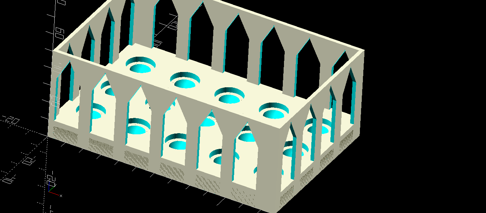

# ot2-tools
## Tools for OT-2 (liquid handling robot from Opentrons).

OT-2 is a Liquid Handler from Opentrons.com

Here I share some 3D designs. 

## Reductors for the `opentrons_10_tuberack_falcon_4x50ml_6x15ml_conical` from Opentrons.
### Reductort for a 10 ml conical tube : 

### Reductor for a 5 ml tube :

## Device for tilting urine tubes to facilitate collection

## Stabilizator for a 15 tubes rack
cf. [bottom_part_for_15_tubes_rack.FCStd](labware/inferior_subpart_for_15_wells_rack/bottom_part_for_15_tubes_rack.FCStd)

## Reprise du code de Sanderson pour la saisie de tubes Eppendorf.
cf . [gripper_bma.scad](labware/pince_pour_tubes/pince1/gripper_bma.scad)

# Objets 3D pour l'étude Resprotect.
[low_profil_rack_for_5ml_tubes.scad](labware/low_profil_rack_for_5ml_tubes/low_profil_rack_for_5ml_tubes.scad) est un plan 3D pour créer un portoir de 15 tubes. Par rapport à la version initiale, le fond du portoir permet de caler des tubes à forme semi-sphérique ou à forme cylindrique. Par ailleurs, le bloc est de faible épaisseur, ce qui facilite la mise en place ou le retrait des tubes, en permettant un accès facile au haut du tube. A utiliser avec le plan [5ml_top_part.FCStd](labware/low_profil_rack_for_5ml_tubes/5ml_top_part.FCStd)

Ref : D_112
